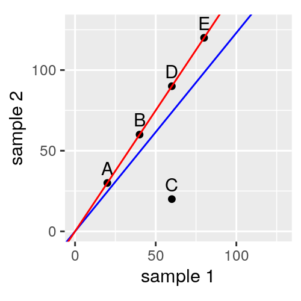
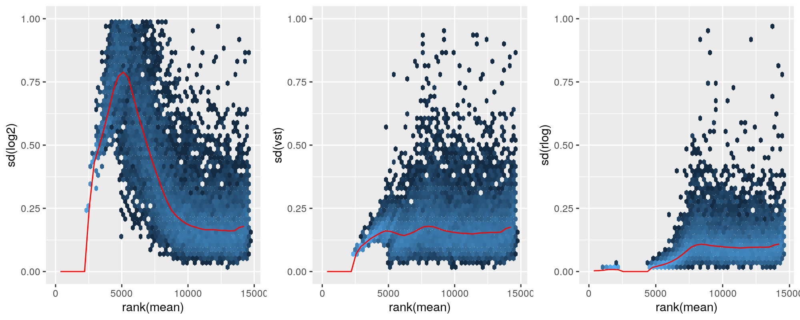

class: inverse middle center big-subsection

```{r setup-options, echo = FALSE, results = "hide", message = FALSE}
options(htmltools.dir.version = FALSE)
knitr::opts_chunk$set(cache = TRUE, dev = 'svg', echo = TRUE, message = FALSE, warning = FALSE,
                      fig.height=6, fig.width = 1.777777*6)
library("vegan")
library("ggplot2")
library("dplyr")
library("tibble")
library("janitor")
library("readr")
data(varespec)
data(varechem)

## plot defaults
theme_set(theme_minimal(base_size = 16, base_family = 'Fira Sans'))
```

# Welcome

---

# Today's topics

* PERMANOVA
* Distance-based RDA
* Diagnostics
* High-throughput count data

---
class: inverse middle center big-subsection

# PERMANOVA

---

# MANOVA

MANOVA is the multivariate form of ANOVA

* Multivariate response data
* Categorical predictor variables

Decompose variation in the responses into

1. variation within groups
2. variation between groups

Test to see if two is unusually large relative to H<sub>0</sub>

---

# PERMANOVA

Doing that test requires lots of assumptions that rarely hold for ecological data

PERMANOVA: Permutational multivariate analysis of variance

Avoids most of these issues through the use of permutation tests

Directly decomposes a dissimilarity matrix into

1. variation within groups
2. variation between groups

---

# PERMANOVA *sensu stricto*

*vegan* has four different ways to do essentially do this kind of analysis

1. `adonis()` &mdash; implements Anderson (2001)
2. `adonis2()` &mdash; implements McArdle & Anderson (2001)
3. `dbrda()` &mdash; implementation based on McArdle & Anderson (2001)
4. `capscale()` &mdash; implements Legendre & Anderson (1999)

Be careful with `adonis()` as it allows only sequential tests

A difference between the functions is how they treat negative eigenvalues

---

# The PERMANOVA idea

.center[
```{r permanova-idea-plot, echo = FALSE}
data(varespec)
     
## Bray-Curtis distances between samples
dis <- vegdist(varespec)
     
## First 16 sites grazed, remaining 8 sites ungrazed
groups <- factor(c(rep(1,16), rep(2,8)), labels = c("grazed","ungrazed"))
     
## Calculate multivariate dispersions
mod <- betadisper(dis, groups)
plot(mod)
```
]

---

# PERMANOA &mdash; `adonis2()`

```{r adonis2-by-terms}
data(dune, dune.env)
adonis2(dune ~ Management*A1, data = dune.env, by = "terms")
```

---

# PERMANOA &mdash; `adonis2()`

```{r adonis2-by-terms-flipped}
data(dune, dune.env)
adonis2(dune ~ A1*Management, data = dune.env, by = "terms")
```

---

# PERMANOA &mdash; `adonis2()`

```{r adonis2-by-margin}
data(dune, dune.env)
adonis2(dune ~ Management*A1, data = dune.env, by = "margin")
```

--

The interaction is the only term that isn't *marginal* to other terms; not significant

---

# PERMANOA &mdash; `adonis2()`

```{r adonis2-margin-2}
adonis2(dune ~ Management + A1, data = dune.env, by = "margin")
```

---

# The dispersion problem

Anderson (2001) noted that PERMANOVA could confound *location* & *dispersion* effects

If one or more groups are more variable &mdash; dispersed around the centroid &mdash; than the others, this can result in a false detection of a difference of means &mdash; a *location* effect

Same problem affects *t* tests, ANOVA

Warton et al (2012)
Anderson & Walsh (2013)
Anderson *et al* (2017)

---

# Dispersion

.center[
```{r permanova-idea-plot, echo = FALSE}
```
]

---

# Test for dispersion effects

Marti Anderson (2006) developed a test for multivariate dispersions &mdash; PERMDISP2

1. Calculate how far each observation is from its group median (or centroid)
2. Take the absolute values of these distances-to-medians
3. Do an ANOVA on the absolute distances with the *groups* as covariates
4. Test the H<sub>0</sub> of equal absolute distances to median among groups using a permutation test

In *vegan* this is `betadisper()`

---

# Test for dispersion effects

.row[
.col-6[
.not-so-small[
```{r permdisp}
data(varespec)
dis <- vegdist(varespec) # Bray-Curtis distances
## First 16 sites grazed, remaining 8 sites ungrazed
groups <- factor(c(rep(1,16), rep(2,8)),
                 labels = c("grazed","ungrazed"))

mod <- betadisper(dis, groups)
mod
```
]
]
.col-6[
```{r permdisp-plot, fig.height = 6, fig.width = 6}
boxplot(mod)
```
]
]

---

# Test for dispersions

.row[

.col-6[
.smaller[
```{r permdisp-anova}
set.seed(25)
permutest(mod)
```
]
]

.col-6[
```{r permdisp-plot-it, fig.width = 6, fig.height = 6}
plot(mod)
```

]
]

---

# Test for dispersions

```{r permdisp-anova-2}
set.seed(4)
permutest(mod, pairwise = TRUE)
```

---

# Test for locations with non-equal dispersion?

Marti Anderson & colleagues (2017) have proposed a solution that is related to the Berens-Fisher problem

This is in Primer but not yet in *vegan*

<https://github.com/vegandevs/vegan/issues/344>

---
class: inverse middle center big-subsection

# Distance-based RDA

---

# Distance-based RDA

Multiple models that all do something Similar

1. `adonis()` (deprecated)
2. `adonis2()`
3. `capscale()`
4. `dbrda()`

They all do essentially the same thing, but they do it differently & have slightly different behaviour

---

# Distance-based RDA

Distance-based RDA (db-RDA) is a constrained form of principal coordinates analysis (PCO)

It is similar to RDA but allows for non-Euclidean dissimilarity indices

In *vegan*, db-RDA is implemented in `dbrda()`

---

# Constrained analysis of principal coordinates

`capscale()` is *another* constrained form of PCO due to Legendre & Anderson (1999)

It is *very* similar to `dbrda()` but handles the negative eigenvalue problem in a different way &mdash; it ignores them!

---

# Constrained analysis of principal coordinates

`capscale()` works by

1. convert the response data into dissimilarities
2. apply PCO on the dissimilarities, take the PCO sample (site) scores as *new* response data
3. fit `rda()` to the *new* response data and predictor variables as constraints

Essentially, we embed the dissimilarities in a Euclidean space using PCO, and then we use RDA on this highly transformed response data

---

# Distance-based RDA

db-RDA foregoes step 2., and directly decomposes the dissimilarities into components explained by each term in the model

Negative eigenvalues resulting from non-metric dissimilarity coefficients are handled via

1. square-root transform of the dissimilarities, or
2. adding a constant to the dissimilarities using methods `"lingoes"` (default, preferred) or `"cailliez"`

db-RDA is based on the ideas in McArdle & Anderson (2001)

--

Err&hellip; isn't that what `adonis2()` was developed to do?

--

*Yes*, but&hellip;

---

# Distance-based RDA

`adonis2()` was a ground up redevelopment of the `adonis()` implementation and as such it retains many of the arguments and concepts of PERMANOVA, just updated to use the direct decomposition of dissimilarities

`dbrda()` inherits from `rda()` and `cca()` and as a result has expanded set of capability

`dbrda()` can use `Condition()` in the formula to fit partial db-RDA

`Condition()` is often needed to provide correct restricted perumtation tests

---

# Distance-based RDA

The equivalent model to `adonis2()` in `dbrda()`-form is

```{r adonis2-by-margin-as-db-rda}
data(dune, dune.env)
dune_dbrda <- dbrda(dune ~ Management * A1, data = dune.env,
    method = "bray")
```

because they have different default `method` values

---
class: inverse middle center subsection

# Ohraz Case Study

---

# Restricted permutations | Ohraz

Analyse the Ohraz data Case study 5 of Leps & Smilauer

Repeated observations of composition from an experiment

* Factorial design (3 replicates)
* Treatments: fertilisation, mowing, *Molinia* removal

Test 1 of the hypotheses

> There are *no* directional changes in species composition in time that are common to all treatments or specific treatments

---

# Restricted permutations | Ohraz

```{r}
spp <- read_csv(url("https://bit.ly/ohraz-spp")) %>%
    rename(label = "...1") %>%
    janitor::clean_names()

molinia <- spp %>%
    select(label:molicaer)

spp <- spp %>%
    select(-molicaer) %>%
    column_to_rownames("label")

env <- read_csv(url("https://bit.ly/ohraz-env")) %>%
    rename(label = "...1") %>%
    mutate(across(c(mowing:removal, plotid), ~ factor(.x))) %>%
    column_to_rownames("label")
```

---

# Distance-based RDA | Ohraz

```{r worked-example-devel-2-with-dbrda}
ohraz_dbrda <- dbrda(spp ~ year +
    year:mowing + year:fertilizer + year:removal +
    Condition(plotid), data = env, method = "bray", add = "lingoes")
h <- how(within = Within(type = "none"),
    plots = Plots(strata = env$plotid, type = "free"))
set.seed(42)
anova(ohraz_dbrda, permutations = h, model = "reduced")
```

---
class: inverse middle center big-subsection

# Other stuff

---

# Diagnostics for constrained ordinations

**vegan** provides a series of diagnostics to help assess the model fit

* `goodness()`
* `inertcomp()`
* `spenvcor()`
* `intersetcor()`
* `vif.caa()`

---

# Diagnostics | goodness of fit

`goodness()` computes a goodness of fit statistic for species or sites, controlled by argument `display`

Gives the cumulative proportion of variance explained by each axis

```{r goodness}
upr <- cca(varespec ~ ., data = varechem)
lwr <- cca(varespec ~ 1, data = varechem)
set.seed(1)

mods <- ordistep(lwr, scope = formula(upr), trace = 0)
head(goodness(mods))
```

---

# Diagnostics | inertia decomposition

`inertcomp()` decomposes the variance in samples or species in partial, constrained, and unconstrained components

* `statistic = "explained` (default) gives the decomposition in terms of variance
* `statistic = "distance"` gives decomposition in terms of the the residual distance

```{r inertcomp}
head(inertcomp(mods, proportional = TRUE))
```

---

# Diagnostics | species-environment correlations

`spenvcor()` returns the (weighted) correlation between the weighted average-based and the linear combination-based sets of site scores

A *poor* measure of goodness of fit. Sensitive to

* outliers (like all correlations)
* overfitting (using too many constraints)

Better models can have poorer species-environment correlations

```{r spenvcor}
spenvcor(mods)
```

---

# Diagnostics | interset correlations

`intersetcor()` returns the (weighted) correlation between the weighted average-based site scores and each constraint variable

Another *poor* diagnostic

* correlation based
* focuses on a single constraint--axis combination at a time

```{r intersetcor}
intersetcor(mods)
```

Vector fitting (`envfit()`) or biplot scores (`scores(model, display = "bp")`) are better alternatives

---
class: inverse middle center big-subsection

# High-throughput data

---

# High-throughput data

Revolutions in biology & biotechnology have lead to exponential increases in our capacity to generate data arising from the counting of biological molecules

* DNA sequencing,
* RNA-Seq &mdash; sequence RNA molecules in populations of cells or tissues,
* ChIp-Seq &mdash; sequence DNA molecules that are bound to particular proteins,
* &hellip;

Relative cheaply, today we can generate data sets with thousands of variables on tens to hundreds of samples

---

# High-throughput data

Counts of such molecules present a statistical challenge

* the counts typically have a large *dynamic range*, covering many orders of magnitudes

* over this very large range we observe changes in both variance (spread about the mean) and also in distribution of the data &mdash; **heterogeneity**

* like other count data, observations are integers and distributions are skewed

* the biotech methodology imparts systematic sampling biases into the data that we need to account for in an analysis &mdash; typically called **normalization** in this sub-field

---

# Sequence depth & size factors

The number of reads for each sample is a kind of *effort* variable

All else equal, the more reads we generate the more species (OTUs, ASVs, etc) we would expect to identify

If number of reads differs between samples (libraries) then, all else equal we might assume the counts in different samples are proportional to one another, following some proportionality factor $s$

A simple estimate for $s$ might be the total reads per sample

But we can do better than this &hellip;

---

# Sequence depth & size factors

.row[
.col-8[
A small dataset of 5 genes in 2 samples

Two views:

1. estimate $s_j$ as $\sum_{i=1}^{m} x_{ij}$, blue line is ratio of $s_j$
2. instead, estimate $s_j$ such that their ratio is the red line

In 1 we would C is downregulated & A, B, D, & E are upregulated

2 is more parsimonious

`DESeq2::estimateSizeFactorsForMatrix()`
]

.col-4[

```{r echo = FALSE}

```

.smaller[Holmes & Huber (2019) Modern Statistics for Modern Biology]
]
]

---

# Variance stabilizing transformations

The square-root transformation is known as the _variance stabilizing transformation_ for the Poisson distribution

Taking the square root of observations that are distributed Poisson leads to *homoscedasticity*

Can construct variance stabilizing transformations for other distributions

High-throughput count data typically show extra-Poisson variation

`DESeq2::varianceStabilizingTransformation()`

---

# Regularized log transform

This transforms counts to a log<sub>2</sub>-like scale via a simple model

$$\log_2(q_{ij}) = \sum_k x_{jk} \beta_{ik}$$

where $q_{ij}$ are the transformed data and $x_{jk}$ is a particular design matrix with a dummy variable for the $j$th sample for ($i = {1, 2, \dots m}$ variables)

Priors on the $\beta_{ik}$ make the model identifiable

The _rlog_ transformation is ~ variance stabilizing, but handles highly varying size factors across samples

`DESeq2::rlogTransformation()`

---

# Transformations

Comparison of three transformations

```{r echo = FALSE}

```

.smaller[Holmes & Huber (2019) Modern Statistics for Modern Biology]

???

Figure 8.12: Per-gene standard deviation (sd, taken across samples) against the rank of the mean, for the shifted logarithm , the variance-stabilizing transformation (vst) and the rlog. Note that for the leftmost  2,500 genes, the counts are all zero, and hence their standard deviation is zero. The mean-sd dependence becomes more interesting for genes with non-zero counts. Note also the high value of the standard deviation for genes that are weakly detected (but not with all zero counts) when the shifted logarithm is used, and compare to the relatively flat shape of the mean-sd relationship for the variance-stabilizing transformation.

---

# Implications

Size factors can be used in GLMs etc to normalize samples via as `offset()` term in the formula

For ordination we can't easily use the size factors

Need to use _vst_ or _rlog_ instead

_rlog_ creates data that can't be used in CCA, so if you use it, RDA or db-RDA are the ordination methods to use

---

# Practicalities

```{r eval = FALSE}
# install.packages("BiocManager")
# BiocManager::install("DESeq2")
library("DESeq2")

dds_asv <- DESeqDataSetFromMatrix(countData = orig_asv, # response count data
                                  colData = meta_data,  # other data including predictors
                                  design = ~ treatment) # experimental design

## Make sure that the control is the reference level
dds_asv$treatment <- relevel(dds_asv$treatment, ref = "CON")

# compute the regularized log transform
rld <- rlog(dds_asv, blind = FALSE)
# compute the variance stabilizing transform
vst <- vst(dds_asv, blind = FALSE)

# extract rlog transformed data & get ready to go into *vegan*
cts <- t(assay(rld))
cts_df <- as.data.frame(cts)
```

---

# Rarefied counts

Can take a random draw $n^{\prime}$ out of the $N$ individuals in a sample in proportion to species abundances

This yields rarefied counts which some people then go on to analyse

Be careful though as this is a random process &mdash; what if you took a different random sample?

---

# Rarefied counts

`avgdist()` in *vegan* tries to get around this by

1. taking a random draw to get rarefied counts
2. computing dissimilarity between smaples on basis of rarefied count

Repeat that many times and then as your dissimilarity $d_{ij}$, take the average of the many $d_{ij}^*$ values you generated above

See also the help page for other suggestions `?avgdist`

---

# References

.smaller[
* Anderson, M.J., 2001. A new method for non-parametric multivariate analysis of variance. Austral Ecol. 26, 32&ndash;46
* Anderson, M.J., 2006. Distance-based tests for homogeneity of multivariate dispersions. Biometrics 62, 245&ndash;253
* Anderson, M.J., Walsh, D.C.I., 2013. PERMANOVA, ANOSIM, and the Mantel test in the face of heterogeneous dispersions: What null hypothesis are you testing? Ecol. Monogr. 83, 557&ndash;574
* Anderson, M.J., Walsh, D.C.I., Robert Clarke, K., Gorley, R.N., Guerra-Castro, E., 2017. Some solutions to the multivariate Behrens-Fisher problem for dissimilarity-based analyses. Aust. N. Z. J. Stat. 59, 57&ndash;79
* Blanchet, F.G., Legendre, P., Borcard, D., 2008. Forward selection of explanatory variables. Ecology 89, 2623&ndash;2632
* Legendre, P., Anderson, M.J., 1999. Distance-based redundancy analysis: testing multispecies responses in multifactorial ecological experiments. Ecol. Monogr. 69, 1&ndash;24
* McArdle, B.H., Anderson, M.J., 2001. Fitting Multivariate Models to Community Data: A Comment on Distance-Based Redundancy Analysis. Ecology 82, 290&ndash;297
]
